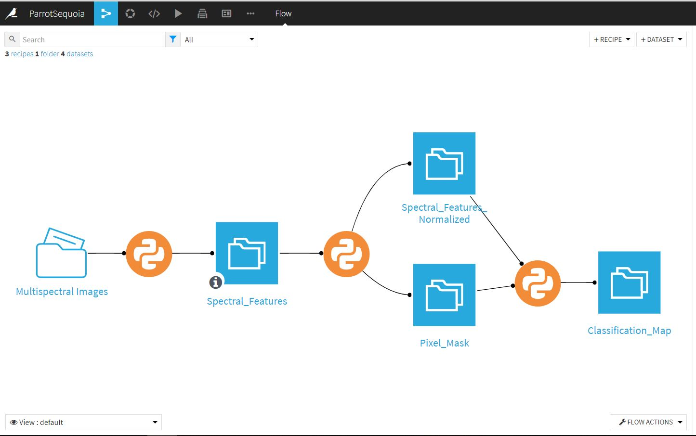
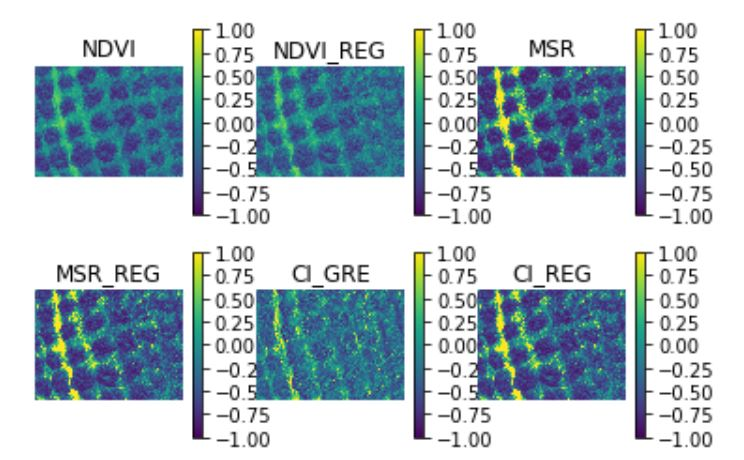
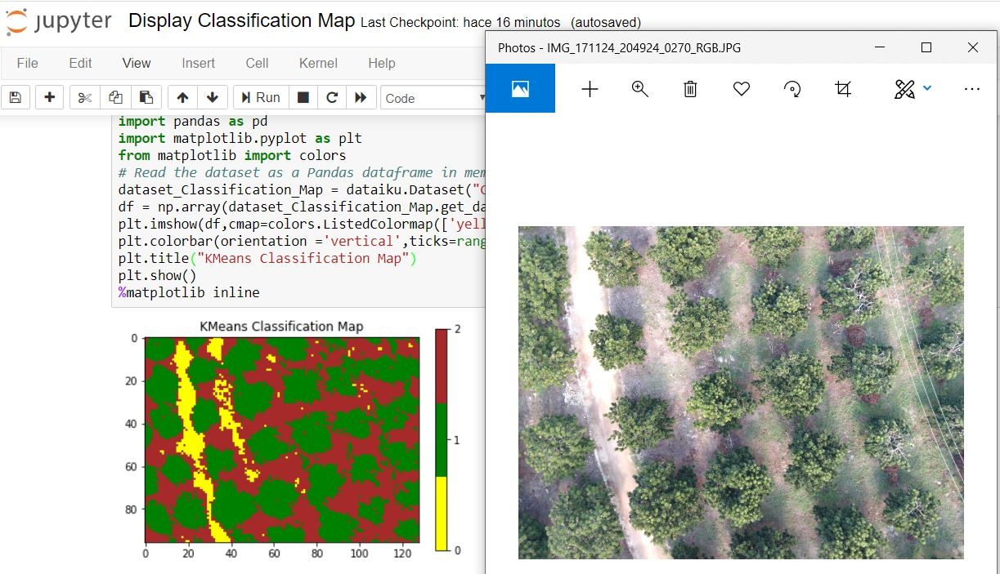
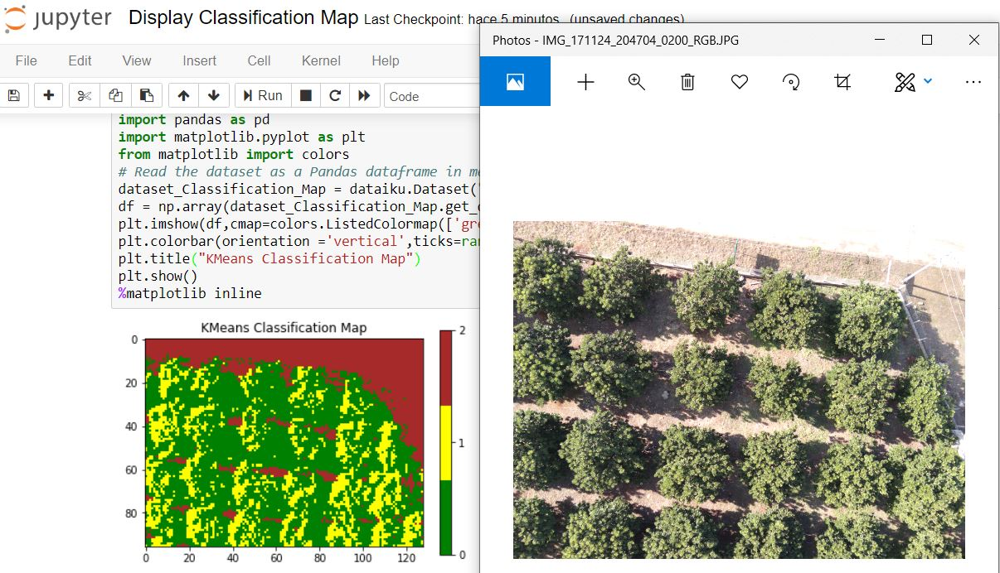

# Description
Dataiku workflow to read, process, and cluster airborne multispectral images acquired with a drone and a Parrot Sequoia sensor.
Main Steps Involved:
1. Data Preparation: Cleansing and normalization.
2. Feature Extraction: Spectral feature computation.
3. Unsupervised Classification: Automatic clustering of crops and soils using a K-Means machine learning model.
# Screenshots

#

#

#

